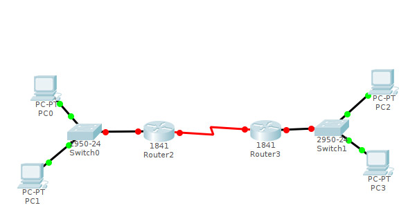

# Subnetting
## VLSM
  

Benötigte Subnetze: **3**  
eins für die linke Seite: 102 clients  
eins für die rechte Seite: 52 Clients  
eins zwischen den Routern: 2 Clients
- 2 Subnetzbits
  - 4 Subnetze á 64 Hosts

### Top Down Planung
- Beginn mit größtem Netz
  - 102 Hosts => Hostsbits: **7** =>
- 2\. größtes Netz
  - 52 Hosts => Anzahl Hostbits: **6** => **2** Subnetzbits
- 3\. größtes Netz
  - 2 Hosts => Anzahl Hostbits: **2** => **6** Subnetzbits
- Neues Netz?
  - 25 Hosts => Anzahl Hostbits: **5** => **3** Subnetzbits

Subnetzmaske:     IIIIIIII.IIIIIIII.IIIIIIII. III00000  
192.168.1.196:    IIIIIIII.IIIIIIII.IIIIIIII. II000I00 -> keine gültige Netzadresse!  
nächste gültige:  IIIIIIII.IIIIIIII.IIIIIIII. III000I00 -> 192.168.1.224  
