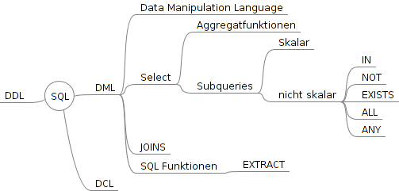

# Klausurthemen
  

Schlüsselwörter in neuer Zeile sonst Punktabzug  
##### UNION befehl
alle datensätze zusammenfügen  
BSP:  
`Tabelle Lieferant` -> `LId,Name`  
`Tabelle Kunde` -> `KId,Name`  
```sql
SELECT LID,Name
FROM Lieferant
UNION All
SELECT KId,Name
FROM Kunde
```

##### JOINs
Inner Join  
Cross Join  
Full Outer Join ~ Left Join Union Right Join  
Self Join Techniken  
- Tabelle auf sich selber joinen  

siehe Dokument

##### Unterabfragen
###### korreliert
Unterabfragen beziehen sich aufeinander, sind abhängig
###### unkorreliert
Unterabfragen können losgelöst ausgeführt werden


#### Übungen
##### Frau Meier wird nur noch 5 Stunden arbeiten,aktualisieren sie den Datensatz
```sql
UPDATE Mitarbeiter
SET ArbeitszeitTag = 5
WHERE Vorname = Barbara
AND Nachname = Maier
```
##### Ermittlen sie die Anzahl der MA die weniger als 6,5 Stunden pro Tag arbeiten
```sql
SELECT COUNT (DISTINCT Nachname) AS AnzMitarbeiter
FROM Mitarbeiter
WHERE ArbeitszeitTag < 6,5
```
##### Geben sie für jeden Mitarbeiter die Anzahl der Fehltage summiert nach Grund aus.
```sql
SELECT f.MAID, m.Nachname,f.Fehlgrund, SUM(f.Fehltage)
FROM fehlzeit f
LEFT JOIN mitarbeiter m
ON f.MAID = m.MAID
GROUP BY f.MAID,f.Fehlgrund
```
##### Ermitteln sie die Einsatzzeiten alle Mitarbeit im Februar 2013
```sql
SELECT e.MAID,m.Nachname,m.Vorname,
sec_to_time((SUM(TIME_TO_SEC((timediff(e.EndZeit,e.StartZeit))))))
as Einsatzzeiten
FROM einsatz e
LEFT JOIN mitarbeiter m
ON m.MAID = e.MAID
WHERE EXTRACT (MONTH FROM e.Datum) = '02'
GROUP BY e.MAID
```
```sql
```
```sql
```
