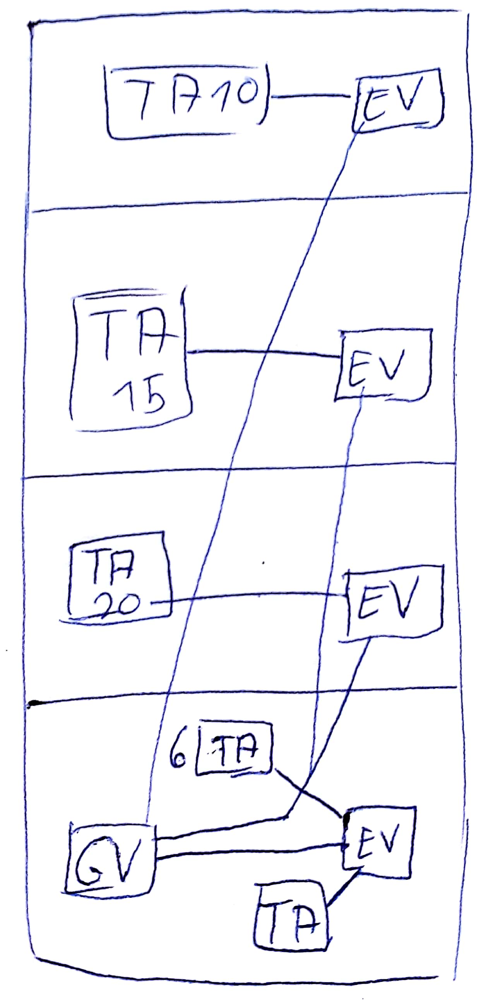
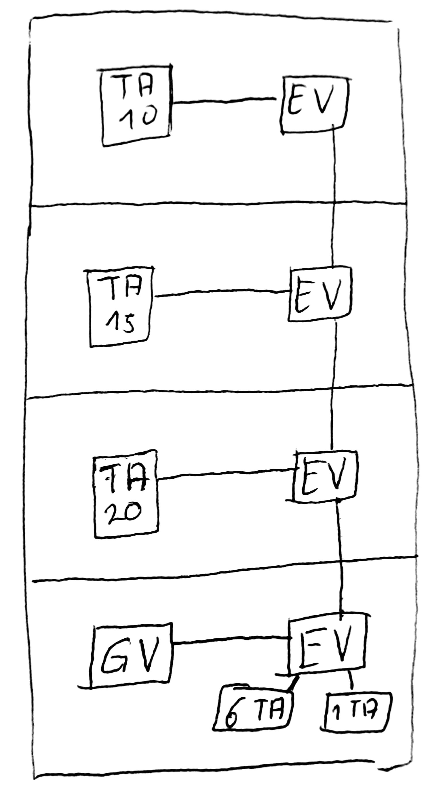

## Lehrkraft 
Ernstmeier  
g.ernstmeier@hnbk.de  

## Themen
- Datenschutz/sicherheit  

## Strukturierte Verkabelung
### a)

### b)
> Vorteile   
- Separierung der Stockwerke, fällt ein Etagenverteiler aus, fallen nicht alle aus.
- Sicherheit, da Netzwerke virtuell getrennt werden können
 
> Nachteile
- mehrere Verteiler kosten Geld
- aufwändigere Verkabelung
- keine zentrale Wartung sondern Aufwände an mehreren Stellen

### c)  

##### Etagenverteiler
verteilt das Netzwerk auf einer Etage.   
ist ein Switch und somit aktiv  
kann gezielt pakete an clients weiterleiten und verhindert "verstopfung" im netz  
##### Gebäudeverteiler
ebenfalls ein Switch
##### Teilnehmeranschluss
Endgerät bspw Desktop und Laptop  
Server  

### d)  

Ein Hub verfügt über keine Paketrouting Logik und sendet jedes eingehende Signal an angeschlossene Clients direkt weiter.  
Ein Switch verfügt über Logik und kann Pakete gezielt an Hosts weiterleiten.

## Subnetting v4
### a)
#### Klasse A
erstes oktet von 1 - 127  
127 reserviert für loopback  
subnetmask 255.0.0.0

#### Klasse B
128.0.x.x bis 191.255.x.x

#### Klasse C
192.0.0.x bis 223.255.255.x  
192.168.x.x reserviert für privates LAN  

#### Klasse D
224.0.0.0 bis 239.255.255.255  
reserviert für Multicasting
keine subnetmask

#### Klasse E
240.0.0.0 bis 255.255.255.254
reserviert für Forschung, Entwicklung und Studien  
keine subnetmask

### b)
192.192.191.0 mit Maske 255.255.255.0
aufteilen in 4 Netze
### ba)
-> 255.255.255.64  
4*64 = 255  
### bb)

