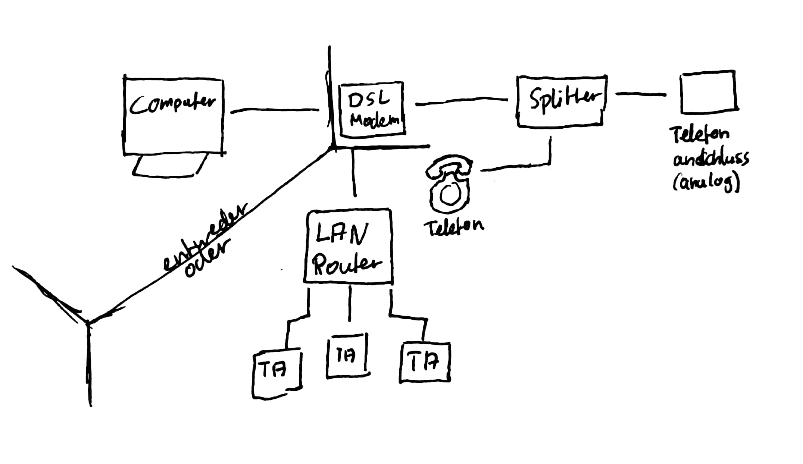

# Recherche Auftrag DSL
## Warum wurde DSL entwickelt?
- ursprünglich übertragungstechnik für ISDN
- Kupferadern sollten weiter verwendet werden
- größerer Frequenzbereich
- trennt Daten von Sprache 
## In welchen Netzabschnitten wurde DSL eingesetzt?
- Vermittlungsstelle <-> Endanschluß
- Letzte Meile
## Welches Übertragungsmedium wird verwendet?
- Kupfer Doppel Ader (eine bis mehrere)
## Was bedeutet "asymmetrisch" bei ADSL und warum wird es verwendet?
- Empfangsrate ist höher als Senderate
- Kunden laden mehr runter als hoch
## Welche Funktion hat der Splitter
- teilt Telefon von DSL Frequenzen in Empfangsrichtung
- führt Telefon und DSL Frequenzen in Senderichtung zusammen
- Anschluss von herkömmlichen ISDN Geräten an DSL Anschluss
## Skizzieren sie eine Standard DSL Anschluss Konfiguration

## Skizzieren sie das DSL Frequenz Spektrum mit 
### ISDN
### POTS im Basisband (Frequenztrennlage, Echokompensation)
## Stellen sie gegenüber:
> Entfernung zur VST, Medium, Datenraten...)
### HDSL
> High Data Rate Digital Subscriber Line
- erste DSL Technologie die höhere Frequenzspektrum der Kupferdoppelader nutzte
- Leiterdurchmesser 0,4mm -> 2,6 km Reichweite
- Doppelader -> 2 km Reichweite
- Datenrate bei 2B1Q: 
    - (eine Doppelader)784 kbit/s
    - (zwei Doppeladers)1544 kbit/s
### SDSL
> Symmetric Digital Subscriber Line
- gleiche Übertragungsrate in beide Richtungen
- meist von geschäftskunden genutzt
- eine Kupfer Doppelader
    - 2,36 Mbit/s
    - Reichweite 8 km
- zwei Kupfer Doppeladern
    - höhere Reichweite
- Glasfaser ebenfalls möglich
    - 2 Mbit/s
    - 11 Mbit/s

### ADSL
> Asymmetric Digital Subscriber Line
- unterschiedliche Datenraten für Sende und Empfangsrichtung
- Telefonleitung (Kupferdoppelader)
- mit steigender Distanz zum Verteiler fallende Übertragungsraten
- bis ca. 10 Mbit/s bis zu einem Kilometer (ADSL1)
- bis ca. 25 Mbit/s bis zu einem Kilometer (ADSL2+)
- Reichweite bis ca. 5 Kilometer

### VDSL
> Very High Speed Digital Subscriber Line
- schnellere Übertragungsraten als ADSL und ADSL2
- VDSL1
    - 52 Mbit/s Empfangsrichtung
    - 11 Mbit/s Senderichtung 
    - Bandbreite sinkt bereits ab 900 Meter auf die Hälfte
    - Medium: vorhandene Kupferdoppelader
- VDSL2
    - symmetrische Anschlüsse möglich
    - bis zu 100 Mbit/s
## Erläutern sie Vectoring 
- Erweiterung von VDSL2 die das Übersprechen von benachbarten Anschlüssen verringern soll.
- Übertragungsrate kann damit gesteigert werden.
- Leitungsdämpfung und Übersprechen sind Hauptfaktoren der Limitierung von Bandbreiten
- durch spezielle Kanalkodierung soll Störung reduziert werden.
- "Da das Übersprechen von physikalischen Effekten der Leitung wie der kapazitiven Kopplung abhängt und prinzipbedingt nicht vermieden werden kann, wird die zu erwartende Störung am Sender geschätzt und im Konstellationsdiagramm die Sendesymbole in der komplexen Ebene bei der verwendeten Quadraturamplitudenmodulation gegensinnig zu der erwarteten Störung verschoben." Zitat [Wikipedia](https://de.wikipedia.org/wiki/VDSL2-Vectoring#Verfahren)
- 