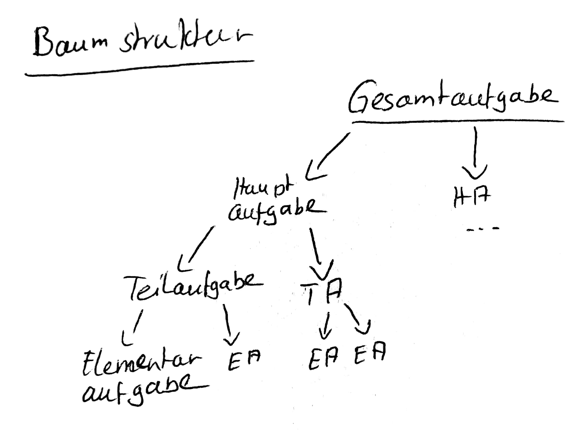

## Lehrkraft 
Fr. Koch  
nur dienstags zu erreichen  
wirtschaft@hnbk.de  
## Klausur
2. Woche 2. Block

## Themen
Projektmanagement

1. Projektmanagement
    1. Projektinitiierung
        1. Projektkennzeichen
            - konkreter Anfangs- und Endzeitpunkt
            - interdisziplinär
            - projektspezifische Organisation
            - einmalig
            - Projektplanung/Risikoplanung
            - Budgetfestsetzung
            - komplex
            - von Wichtigkeit für das Unternehmen
        2. Projektbeteiligten
            - Auftraggeber
            - Kunde
            - Externe Dienstleister
            - Lenkungsausschuss
            - Projektleiter, Projektmanager
            - Abteilungsleiter
            - Projektmitarbeiter
        3. Projektanlässe
            - Negative Problemerkennung
                - **Das IST weicht negativ vom SOLL ab.**
                - Benchmarking
                - Mängelquantifizierung
                - Checklistenverfahren
            - Positive Problemerkennung
                - **SOLL wird durch ein neues SOLL ersetzt.**
        4. Ziele
            - komplementäre Ziele (Ziel 1 fördert Ziel 2)
            - konfligierende Ziele (Ziel 1 hindert Ziel 2)
            - neutrale, indifferente Ziel (Ziel 1 unabhängig von Ziel 2)
            - [SMART - Infoblatt](Material/20171010_Projektmanagement.pdf)
                - Gewinn des Unternehmens soll bis zum 31.12. um 100.000€ gesteigert werden.
            - [DB Übungsaufgabe](Material/20171010_PM_DB.pdf)
                - Erkennung von technischen Defekten
                - Info der Fahrgäste über Veränderungen
                - Verzögerungen erkennen & berechnen
                - Errechnung / Ausstellung von Rabatten
                - Steigerung der Kundenzufriedenheit
                - Gesamtkosten für das Rechnungswesen ermitteln
                - lernfähige Software
        5. Risiken
            - Portfolio für Projekte
            - Beispiel BD: Mögliche Risiken
                - Software wird nicht rechtzeitig fertig
                - Software ist verbugged
                - Software erfüllt die geforderten Anforderungen nicht
                - Rabattkosten explodieren
                - Entwicklungs/Wartungsskosten explodieren
                - Nutzer nehmen die Software nicht an
                - Zu hohe Resourcennutzung
                - Umstrukturierung
            - Maßnahmen zur Risikominimierung ergreifen
            - Dreieck des Projektmanagements:
                - Ergebnis/Qualität
                - Dauer/Termine
                - Aufwand/Kosten
        6. [Antrag](./Material/2017_10_17_Projektantrag_Beispiel.pdf)
        7. [Phasen eines Projektes](./Material/2017_10_17_Projektphasen.pdf)
2. Projektplanung
    - Def. geistige Vorwegnahme zukünftigen Handelns(-> Projektdurchführung)
    1. Aufgabenplanung
        - Methoden:
            - Baumstruktur  
            - {width=250px}
        - [Material zur Aufgabenplanung](./Material/2017_10_17_Projektplanung.pdf)
        - Aufgaben Orientierung  
        - {:width=150px}
        - Projektablaufplan
        - {width=150px}
    2. Terminplanung
        1. Gantt
            - [Material](./Material/2017_10_17_Gantt.pdf)
            - [Aufgabe 1](./Material/20171017_Gantt_Aufgabe1.ods)
            - **Aufgabe 2:** 26 Arbeitstage -> läuft bis 20. Juli 20...
            - **Aufgabe 3:** 
    3. Personalplanung
        - qualitative und quantitative Personalplanung
        - Personaleinsatzplanung
        - [Gewichtungsverfahren](./Material/20180130_Gewichtungsverfahren.pdf)
    4. Kostenplanung
        - [Kosten Nutzen Analyse](./Material/20180206_KostenNutzen.pdf)
        - [Nutzwert Analyse](./Material/20180206_Nutzwert.pdf)
    5. Sonstige Planung
        - Sachmittelplanung
            - Lizenzen
        - Dokumentenplanung 
            - (z.B. Pflichten-, Lastenheft, ISO 9000, Kundendokumentation, etc.)
        - Berichtsplanung
            - Benennen der Adressaten und Berichtsrhythmus
            - Berichtsarten: z.B. Meilensteine, Fortschrittsbericht, Review
3. Projektorganisation
    - Beteilige (JB Lenkungsausschuss)
        - 
    - Projektleiter
        - Aufgaben
        - Kompetenzen
    - Projektteam
        - Auswahlmethoden (z.B. Tests)
        - Kick Off Meetings
            - Projektvorstellung
            - Projektziele/-nutzen
            - Benennung der Ansprechpartner
            - Grobe Zuteilung der Aufgaben (zeitlicher Ablauf)
            - Vorstellung der Mitglieder
        - Ergebnissicherung über Protokolle
