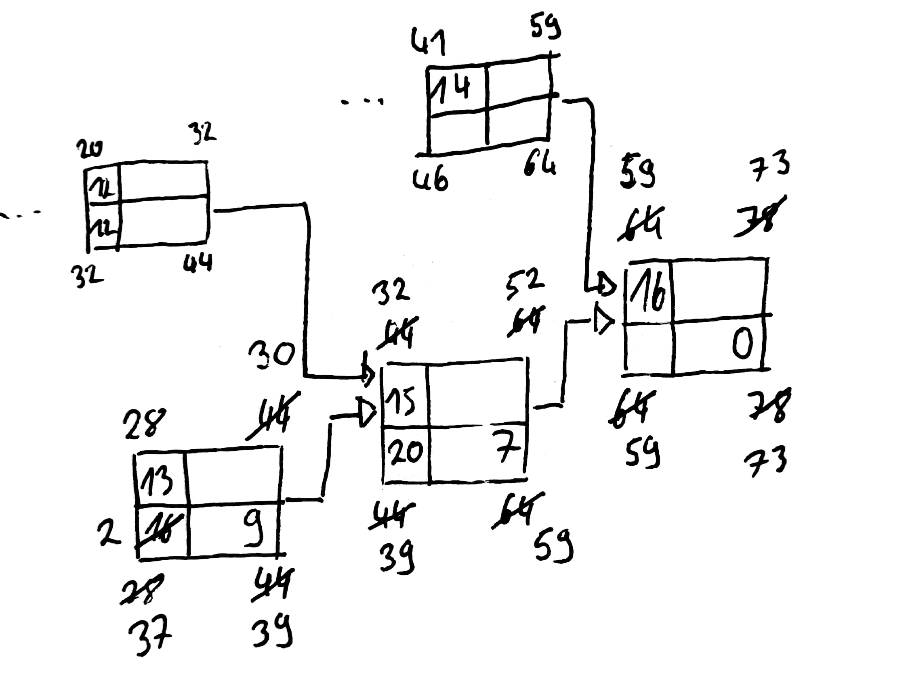

## Mängelquantifizierung
- Überlange Bearbeitungsdauer
- Mangelhafte Qualität Endprodukt
- "viele Tickets" 

Fehlergrund|Referenzgröße|Fehlerhäufigkeit|Prozent
---|---|---|---
Überlange Bearbeitungszeit|2000|100|5%
Mangelhafte Qualität|2000|1000|50%
viele Tickets|2000|200|10%

# Netzpläne
[Material](./Material/20180130_handlungssituation.pdf)

Nr.|Art|Zeitliche Änderung|Auswirkung GP|Auswirkung Projektende|Anmerkung
---|---|---|---|---|---|---
1|kritischer Vorgang|Verzögerung (4 Tage)|-|Verzögerung um 4 Tage|
13|kritischer Vorgang|Beschleunigung (14 Tage)|steigt|Beschleunigung|siehe [Bild 1](#bild-1)
11|nicht kritisch|Verzögerung (5 Tage)|Sinkt auf 0|-
10|nicht kritisch|Beschleunigung (1 Tag)|steigt|-
14|nicht kritisch|Verzögerung (6 Tage)|sinkt auf 0|Verzögerung um 1 Tag
5|nicht kritisch|Verzögerung (5 Tage)|sinkt|-

##### Bild 1


## COCOMO
#### Definieren sie Personenmonat
Die Summe an Stunden, die eine Person in einem Monat, mit 8 Stunden Arbeit am Tag erreichen kann.
Durchschnittliche Arbeitszeit einer Person 

#### Benennen sie ein Beispiel dafür , dass man nicht einfach, die Personenmonate durch eine beliebige Anzahl von Personen teilen kann, um die Projektdauer zu ermitteln.
Ein Baby kann nicht durch 9 Frauen in einem Monat zur Welt gebracht werden.

#### Führen sie eine Aufwands- und Dauerschätzung nach dem COCOMO Basismodell für ein organisches Projekt mit ca. 30 KDSI durch.

```m
A = 2,4 * KDSI^1,05    
A = 2,4 * 30^1,05  
A = 85,34  Personenmonate(PM)  
```

```m
TDEV = 2,5 * PM^0,38  
TDEV = 2,5* 85,34^0,38  
TDEV = 13,55 Monate  
```
### Gewichtungsverfahren
```m
= (E+V+A)*(K+E)  
= (6+3+6)*(0,5+3)  
= 15 * (3,5)  
= 52,5 MT  
 ```